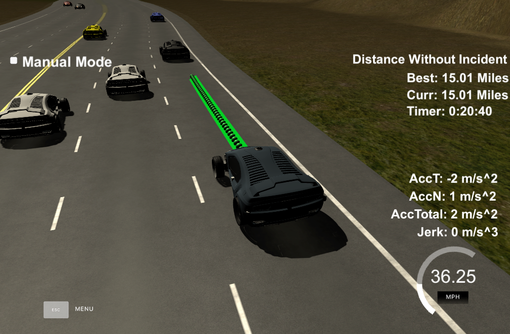

# Model Documentation

## Compilation

### The code compiles correctly.

No changes were made in the cmake configuration. A new file was added [src/spline.h](./scr/spline.h). It is the [Cubic Spline interpolation implementation](http://kluge.in-chemnitz.de/opensource/spline/): a single .h file you can use splines instead of polynomials. It was a great suggestion from the classroom QA video. It works great.

## Valid trajectories

### The car is able to drive at least 4.32 miles without incident.
I ran the simulator for 15 and 20 miles without incidents:

### The car drives according to the speed limit.
No speed limit red message was seen.

### Max Acceleration and Jerk are not Exceeded.
Max jerk red message was not seen.

### Car does not have collisions.
No collisions.

### The car stays in its lane, except for the time between changing lanes.
The car stays in its lane most of the time but when it changes lane because of traffic or to return to the center lane.

### The car is able to change lanes
The car change lanes when the there is a slow car in front of it, and it is safe to change lanes (no other cars around) or when it is safe to return the center lane.

## Reflection

Based on the provided code from the seed project, the path planning algorithms start at [src/main.cpp](./src/main.cpp#L246) line 246 to the line 416. The code could be separated into different functions to show the overall process, but I prefer to have everything in a single place to avoid jumping to different parts of the file or other files. In a more complicated environment and different requirements, more structure could be used. For now, comments are provided to improve the code readability.

The code consist of three parts:

### Prediction [line 255 to line 290](./src/main.cpp#L255)
This part of the code deal with the telemetry and sensor fusion data. It intents to reason about the environment. In the case, we want to know three aspects of it:

- Is there a car in front of us blocking the traffic.
- Is there a car to the right of us making a lane change not safe.
- Is there a car to the left of us making a lane change not safe.

These questions are answered by calculating the lane each other car is and the position it will be at the end of the last plan trajectory. A car is considered "dangerous" when its distance to our car is less than 30 meters in front or behind us.

### Behavior [line 292 to line 314](./scr/main.cpp#L293)
This part decides what to do:
  - If we have a car in front of us, do we change lanes?
  - Do we speed up or slow down?

Based on the prediction of the situation we are in, this code increases the speed, decrease speed, or make a lane change when it is safe. Instead of increasing the speed at this part of the code, a `speed_diff` is created to be used for speed changes when generating the trajectory in the last part of the code. This approach makes the car more responsive acting faster to changing situations like a car in front of it trying to apply breaks to cause a collision.

### Trajectory [line 317 to line 416](./scr/main.cpp#L313)
This code does the calculation of the trajectory based on the speed and lane output from the behavior, car coordinates and past path points.

First, the last two points of the previous trajectory (or the car position if there are no previous trajectory, lines 321 to 345) are used in conjunction three points at a far distance (lines 348 to 350) to initialize the spline calculation (line 370 and 371). To make the work less complicated to the spline calculation based on those points, the coordinates are transformed (shift and rotation) to local car coordinates (lines 361 to 367).

In order to ensure more continuity on the trajectory (in addition to adding the last two point of the pass trajectory to the spline adjustment), the pass trajectory points are copied to the new trajectory (lines 374 to 379). The rest of the points are calculated by evaluating the spline and transforming the output coordinates to not local coordinates (lines 388 to 407). Worth noticing the change in the velocity of the car from line 393 to 398. The speed change is decided on the behavior part of the code, but it is used in that part to increase/decrease speed on every trajectory points instead of doing it for the complete trajectory.